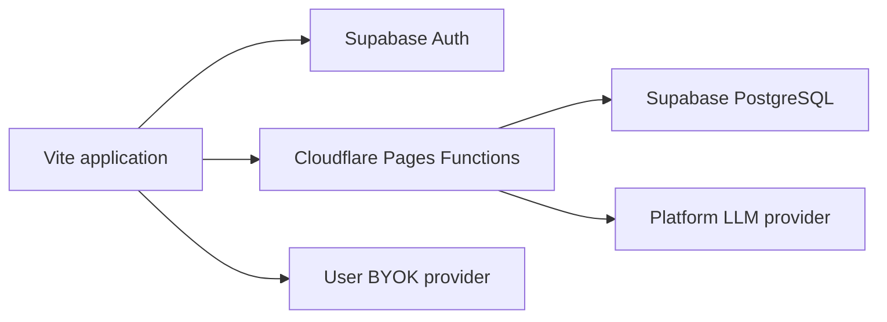

# LuminaBook Account and Daily Credits

LuminaBook supports optional email accounts and a server-funded daily LLM allowance while preserving the existing anonymous bring-your-own-key workflow.

## Implemented Scope

- Email and password registration through Supabase Auth.
- Email verification using the Supabase project policy.
- Persistent browser sessions.
- A 50,000-unit daily allowance that resets at 00:00 UTC.
- Atomic quota reservation, settlement, and release in PostgreSQL.
- A Cloudflare Pages Function that validates the user, protects the platform model key, and records actual model usage.
- A locked `[FREE-QWEN]` model-provider preset backed by the platform-managed `qwen-flash` model.
- A lightweight personal usage view with seven-day activity, 30-day totals, operation breakdown, and recent requests.
- A protected `/admin` dashboard with operational metrics, user search, detailed usage filters, suspension, allowance overrides, and internal notes.
- Existing direct OpenAI-compatible providers remain available without an account.
- Books, translations, highlights, notes, and reading progress remain on the device.

Phone login, Turnstile enforcement, paid plans, and cloud library synchronization are not part of this implementation.

## Architecture



## 1. Create the Supabase Project

Create a Supabase project in the exact AWS Singapore region when that option is available. Record:

- Project URL.
- Publishable or anonymous key.
- Service-role key.

The service-role key bypasses row-level security. It must only be stored as a Cloudflare server secret and must never use the `VITE_` prefix.

In **Authentication > URL Configuration**, configure:

- Site URL: the production Cloudflare Pages or custom-domain URL.
- Redirect URL: the production URL and any required preview or local-development URLs.

Keep email confirmation enabled for production.

## 2. Apply the Database Migration

Apply both migrations in order:

```text
supabase/migrations/202606200001_account_quota.sql
supabase/migrations/202606200002_usage_dashboards.sql
```

**This step is required before the first account/quota test.** Supabase Auth can successfully create and sign in a user without these tables, but `/api/quota`, `/api/usage`, funded model calls, and the admin dashboard cannot work until both migrations have completed.

For an initial manual setup, paste the migration into the Supabase SQL Editor and run it once. For managed environments, use the Supabase CLI migration workflow.

The migration creates:

- `profiles` for locale and regional account metadata.
- `quota_periods` for the daily allowance and current usage.
- `usage_events` for immutable request accounting.
- `reserve_daily_quota` for atomic preflight reservations.
- `settle_daily_quota` for charging actual provider usage.
- `release_daily_quota` for failed requests.
- `account_admins` as the explicit administrator allowlist.
- `account_controls` for suspension, allowance overrides, and protected notes.
- `admin_audit_log` for administrator changes.
- Usage-event latency, response status, and estimated provider cost fields.

Only the service role can execute quota mutation functions. Authenticated users can read their own profile, quota, and usage rows through row-level security.

## 3. Configure Browser Variables

Copy `.env.example` to `.env.local` for the Vite build and set:

```dotenv
VITE_SUPABASE_URL=https://YOUR_PROJECT.supabase.co
VITE_SUPABASE_ANON_KEY=YOUR_PUBLIC_ANON_KEY
```

For Cloudflare Pages, add the same two values under the project's build environment variables for both production and any desired preview environment.

These values are public identifiers used by Supabase Auth. Do not put the service-role key or an LLM provider key in a `VITE_` variable.

## 4. Configure Cloudflare Function Secrets

In the Cloudflare Pages project, add these encrypted server variables:

```text
SUPABASE_URL
SUPABASE_ANON_KEY
SUPABASE_SERVICE_ROLE_KEY
PLATFORM_LLM_ENDPOINT
PLATFORM_LLM_API_KEY
PLATFORM_LLM_MODEL
PLATFORM_LLM_INPUT_USD_PER_MILLION
PLATFORM_LLM_OUTPUT_USD_PER_MILLION
```
The final two variables are optional. Set them to the selected model's current USD prices per million input and output tokens to enable the admin cost estimate. Recheck these values whenever provider pricing changes.

Example endpoint values:

```text
PLATFORM_LLM_ENDPOINT=YOUR_OPENAI_COMPATIBLE_QWEN_ENDPOINT
PLATFORM_LLM_MODEL=qwen-flash
```

The platform provider must expose an OpenAI-compatible chat-completions response, including `choices[0].message.content`. Provider token usage is used when available; otherwise the Function applies a conservative estimate.

Redeploy the Pages project after adding or changing build variables. Function-secret changes may also require a deployment before all versions use the new values.

## 5. Local Development

`npm run dev` serves only the Vite frontend. It does not run Pages Functions. Requests such as `/api/usage` fall back to the SPA HTML document, so this command is suitable for frontend-only work but not account/quota testing.

Copy the server-variable template without committing it:

```bash
cp .dev.vars.example .dev.vars
```

Fill in the Supabase service-role and platform-provider values, then run the full local Pages environment:

```bash
npm run dev:cloudflare
```

The command builds Vite, starts Cloudflare Pages Functions, and serves the application at:

```text
http://localhost:8788
```

Add that origin to the Supabase Authentication redirect URL allowlist. `.env`, `.env.local`, `.dev.vars`, and Wrangler state are ignored by Git; only their example templates are tracked.

Expected diagnostics:

- `API is not running`: the page was opened from Vite instead of port `8788`.
- `Account database migrations are missing`: Wrangler is running, but one or both SQL migrations have not been applied.

## 6. Verify the User Flow

1. Open the account menu in the library header.
2. Create an account with an email and a password of at least eight characters.
3. Complete email verification if no session is issued immediately.
4. Sign in and confirm that 50,000 daily units are displayed.
5. Open model configuration and select `[FREE-QWEN]`.
6. Translate one page.
7. Confirm that the remaining units decrease.
8. Confirm that a `completed` row exists in `usage_events`.
9. Sign out and verify that personal BYOK profiles still work.

Also test a provider failure. The matching usage event should become `failed`, and its reservation should return to the available balance.

## Administrator Setup

Administrator access is never granted automatically. First register and verify the administrator as a normal user, then find the user ID in Supabase Authentication or with:

```sql
select id, email, created_at
from auth.users
order by created_at;
```

Add that specific user to the allowlist:

```sql
insert into public.account_admins (user_id)
values ('ADMIN_USER_UUID')
on conflict (user_id) do nothing;
```

Sign in through the normal LuminaBook account menu and open `/admin`. The server checks `account_admins` on every admin API request; hiding the page or link is not the security boundary.

The admin dashboard provides:

- Requests, active funded users, weighted units, tokens, estimated cost, failure rate, average latency, and unsettled reservations.
- Daily consumption and operation summaries for 7, 30, or 90 days.
- Searchable user accounts with today's allowance and 30-day usage.
- Account suspension that blocks funded requests but preserves BYOK access.
- Per-user daily allowance overrides, including zero allowance.
- Protected internal notes and an audit record of every control update.
- Filterable detailed usage events with model, token, status, latency, cost, and error information.

The first version intentionally caps administrative list queries. The user list reads up to 1,000 Supabase Auth users, displays up to 500 matches, and detailed usage displays the latest 500 filtered events. Add cursor pagination before operating beyond those volumes.

## Quota Semantics

The user-facing promise is approximately ten normal pages per day. Internally, usage is charged as weighted units:

```text
charged units = input tokens + output tokens * 3
```

Before calling the provider, the Function reserves a conservative upper bound. After a successful response, the database replaces that reservation with the actual weighted usage. Failed requests release their reservation.

The initial 50,000-unit allowance is provisional. Use production `usage_events` to measure the median and 90th-percentile cost of page translation, then adjust the allowance so ten representative pages fit without making unusually large pages free.

## Security Notes

- Never send the Supabase service-role or platform LLM key to the browser.
- Keep the platform model and maximum output limits controlled by the Pages Function.
- Treat quotas as financial controls, not only UI state.
- Keep request IDs unique so database accounting is idempotent.
- Rate-limit `/api/llm` by authenticated user and IP before a broad public launch.
- Add Cloudflare Turnstile to signup and recovery before offering credits at scale.
- Add budget alerts and provider-side spending limits.
- Store no uploaded books in the account database during this phase.

## Next Account Milestones

1. Add Turnstile and endpoint rate limiting.
2. Add password-reset and email-change UI.
3. Localize the account and admin interfaces in English and Simplified Chinese.
4. Add cursor pagination and CSV export to the admin dashboard.
5. Add subscription entitlements only after free-credit economics are measured.
6. Evaluate a mainland-capable SMS provider before enabling phone login.

Last reviewed: 2026-06-21
